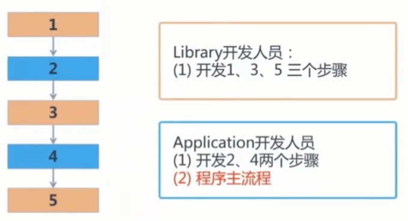
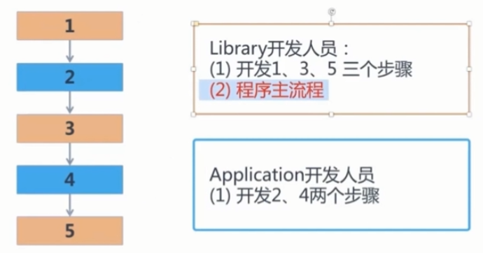
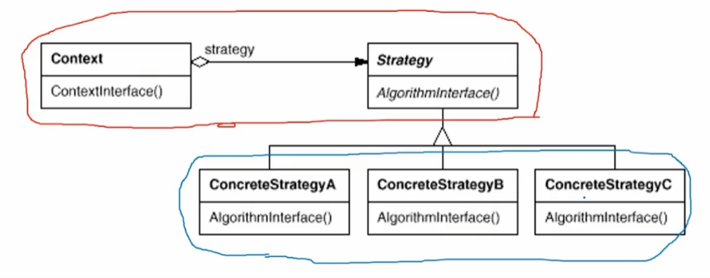
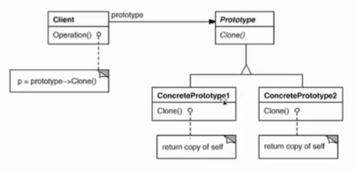
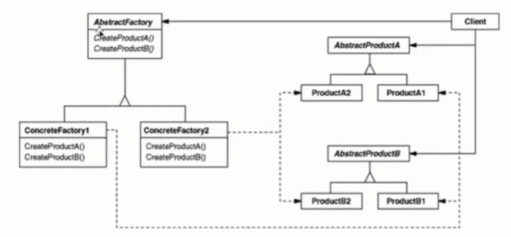
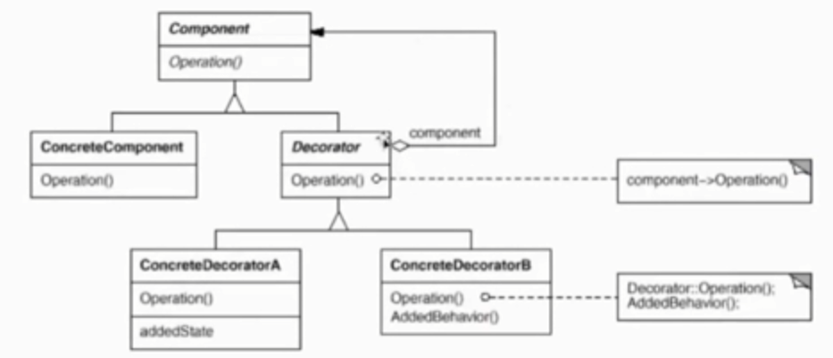
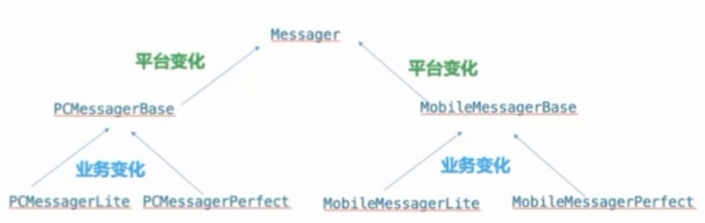
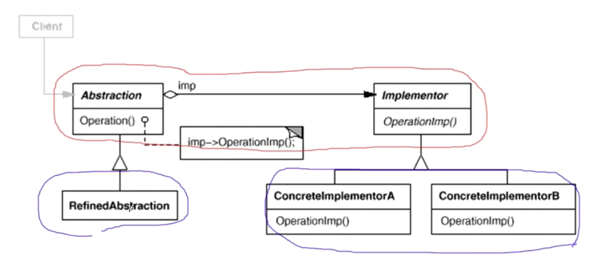

# 设计模式

[1. 设计模式最高宗旨](#1)

[2. 正交设计](#2)

[3. 软件设计复杂根本原因](#3)

[4. 面向对象设计三原则](#4)

[5. 软件设计五大原则](#5)

[6. 设计习语](#6)

[7. Template Method模式](#7)

[8. strategy模式](#8)

[9. observer观察者模式](#9)

[10. 工厂模式](#10)

[11. Decorator模式](#11)

[12. Bridge模式](#12)

## <a name="1"></a>1. 任何设计模式的最高宗旨（金科玉律）：高内聚，低耦合

## <a name="2"></a>2. 正交设计
### 软件设计正交性
* 正交意味着独立性，如果A的改变不影响B，那么A和B在设计上是正交的
* 设计正交，即设计解耦，通过解耦消除不相关属性的影响
### 正交设计四原则
* 消除重复性
    * 函数代码重复、数据成员重复、子父类重复、结构性重复……一切形式的重复都要革除
* 分离关注点
    * 不同关注点的变化方向不一样，分离是为了更好的隔离变化
* 减少不必要的依赖
    * 依赖总是会有的，不必要的依赖关系会带来变化中的脆弱性
* 向稳定方向依赖
    * 依赖稳定点，稳定点即编程契约：抽象类、接口

## <a name="3"></a>3. 软件设计复杂的根本原因:  变化
* 客户需求的变化
* 技术平台的变化
* 开发团队的变化
* 市场环境的变化
* ……

其实，只要明白虚函数调用机制、运行时多态的机制，大家去阅读23种设计模式的代码，都能读懂，而这种懂也仅仅是能懂代码结构的调用关系，但你深入思考：为什么这么做呢？这个时候你通常是不太理解的。

其实就是缺乏对变化经验性的判断，缺少设计模式的最高宗旨的指导，这个时候你去看设计模式的代码往往把它们当作算法去学习。这就陷入了一种误区。

## <a name="4"></a>4. 面向对象设计三原则
从抽象设计角度重新认识“面向对象”的设计内涵：
* 封装：封装责任，隔离变化；建立责任的边界
* 继承：优先使用对象组合，而不是类继承（实现继承）。
* 多态：针对接口编程，而不是针对实现编程


## <a name="5"></a>5. 软件设计五大原则（SOLID）
* SRP(Single Responsibility Principle)，单一职责原则
* OCP(Open Close Principle)，开闭原则
* LSP(Liskov Substitution Principle)，里氏替换原则
* ISP(Interface Segregation Principle)，接口隔离原则
* DIP(Dependency Inversion Principle)，依赖倒置原则

### SRP (Single Responsibility Principle)
* 一个类应该仅有一个引起它变化的原因
* 变化的方向隐含着类的责任

### OCP (Open Close Principle)
* 对扩展开放，对更改封闭
* 类模块应该是可扩展的（比如: 增加一个抽象类的子类），但是不可修改

### LSP (Liskov Substitution Principle)
* 子类必须能够替换它们的基类（IS-A）
* 继承表达类型抽象

### ISP (Interface Segregation Principle)
* 不应该强迫客户程序依赖它们不用的方法
* 接口应该小而完备

### DIP (Dependency Inversion Principle)
* 高层模块(稳定)不应该依赖低层模块(变化)，二者都应该依赖于抽象(稳定)
* 抽象(稳定)不应该依赖于实现细节(变化)，实现细节应该依赖于抽象(稳定)

## <a name="6"></a>6. 设计习语
### RAII (Resource Acquisition Is Initialization)
* RAII 是C++内存和资源管理最重要的机制之一
* RAII 通过三个环节保证内存或资源得到确定性释放
    1. 构造器获取内存
    2. 析构器释放内存
    3. 栈对象在作用域结束，即确定调用析构器，回收内存
* RAII的析构机制是由编译器根据对象生命周期销毁机制自动确保，无需手工干预。
* RAII更建议我们在声明对象时候声明成栈对象，如果非堆上对象，就用智能指针包起来

```C++
void process(int data) {
    cout<<"process start"<<endl;
    MyClass *p = new MyClass();
    if (data < 0) {
        invalid_argument exp("data");
        throw exp;
    }

    cout<<"process end"<<endl;
    delete p;
}
```
上面代码存在风险，delete p可能不会被执行。推荐的做法如下：
```C++
void process(int data) {
    cout<<"process start"<<endl;
    // 智能指针，栈对象包装堆上的对象。
    // 好处：异常出现时候，栈对象析构能正常执行
    SmartPtr p(new MyClass());

    if (data < 0) {
        invalid_argument exp("data");
        throw exp;
    }

    cout<<"process end"<<endl;
}
```

RAII核心优势：
* 异常免疫，即使异常，也确保析构
* 针对对象嵌套是递归进行的

### ScopeGuard 范围守卫
借助了RAII，在构造的时候注入一个可调用对象 
* 函数指针
* 函数对象
* Lambda
* std::function

如果我们有一段代码在函数里面想要 **确定调用**，可以使用ScopeGuard，应用场景：
1. 资源确定释放
2. 代码回退

[参考示例代码](./ScopeGuard/ScopeGuard.cpp)

## <a name="7"></a>7. Template Method模式
“组件和应用”通常有所谓的稳定点和扩展点，"晚期扩展"模式通过晚期绑定，来实现组件和应用之间的松耦合。是二者协作的常用模式。

"晚期扩展" 要点：
1. 稳定的整体结构 （这也是任何一个设计模式限制，TemplateMethod需要一个稳定的整体结构，如果这点无法满足，这个设计模式就破功了）
2. 各个子步骤需要变化或者晚期绑定

**场景描述**：一个完整功能需要，step1，step2，step3，step4，step5，5个步骤。其中1，3，5是库开发的。2，4需要应用开发者实现。也就是2，4是有改变的需求，不能写死。

### 结构化设计思路
如果不用Template Method模式，一种可能的实现如下 ( [完整示例代码](./TemplateMethod/template1.cpp) ) ：

```c++
using namespace std;

/**
 * 库开发
 */
class Library 
{
public:
    void step1() {
        cout << "Library.step1()" << endl;
    }

    void step3() {
        cout << "Library.step3()" << endl;
    }

    void step5() {
        cout << "Library.step5()" << endl;
    }

};

/**
 * 应用开发
 */
class App 
{
public:
    bool step2() {
        cout << "App.step2()" << endl;
        number++;
        return number >= 4;
    }

    int step4() {
        cout << "App.step4()" << endl;
        return number;
    }

    int number{0};
};

int main() {
    Library lib;
    App app;

    // 应用程序开发 还需要把这5个步骤连起来
    lib.step1();
    while (!app.step2()) {
        lib.step3();
    }
    app.step4();
    lib.step5();

    return 0;
}
```

流程如下图：



### Template Method方式实现

 [完整示例代码](./TemplateMethod/template2.cpp)

```c++
/**
 * 库开发
 */
class Library 
{
public:
    void run() 
    {
        step1();
        while (!step2()) {  // 多态调用
            step3();
        }
        step4();    // 多态调用
        step5();
    }

    virtual ~Library(){}

protected:
    void step1() 
    {
        cout << "Library.step1()" << endl;
    }

    void step3() 
    {
        cout << "Library.step3()" << endl;
    }

    void step5() 
    {
        cout << "Library.step5()" << endl;
    }

private:    // 设计习语：NVI：Non-Virtual Interface
    virtual bool step2() = 0;
    virtual int step4() = 0;
};

/**
 * 应用开发
 */
class App : public Library
{
private:
    bool step2() override 
    {
        cout << "App.step2()" << endl;
        number++;
        return number >= 4;
    }

    int step4() override     
    {
        cout << "App.step4()" << endl;
        return number;
    }

    int number{0};
};

int main() 
{
    Library *pLib = new App();

    // 1. 存储成本：虚表指针 + 虚表结构(共享)
    // 2. 调用成本：指针间接运算，无法inline（一些小函数代价过高）
    pLib->run();

    delete pLib;

    return 0;
}
```

程序流程如下图：



模式要点总结：
1. 程序的主流程被复用了（稳定的结构），也就是run方法
2. step2和step4是扩展点，留给应用程序晚期扩展
3. Template Method的典型应用"不要调用我，让我来调用你"反向控制结构

#### 代码细节
问：虚函数step2，step4为什么private

答：**NVI：Non-Virtual Interface（公有接口非虚，虚函数尽量私有）**。因为虚函数作为整个程序骨架的一部分，不会被外界独立调用。所以要进行private，除非子类有调用需求，可以设为protected。

### 编译时多态实现TemplateMethod
#### 设计习语：CRTP
Curiously Recurring Template Pattern，奇异递归模板模式，简称CRTP。通过将基类的模板参数设为子类，从而实现了静态多态。CRTP用模板的方式模拟虚函数调用机制，让类没有任何虚函数。C++独有，其它语言没有。

虚函数成本：
1. 存储成本：虚表指针 + 虚表结构(共享)
2. 调用成本：指针间接运算，无法inline（一些小函数代价过高）

CRTP示例代码如下：

```c++
#include <iostream>

using namespace std;
template <typename T>
class Base 
{
public:
    Base() : i_(0) {}

    void process() { sub()->process_imp();}
    void process_imp() 
    {
        cout<<"Base::process()"<<endl;
    }

    T* sub() { return static_cast<T*>(this); }

    int get() const {return i_; }

    ~Base() {}

    // CRTP 析构需要单独实现。因为析构函数非虚
    void destroy() {
        // 析构子类，子类会自动调用父类析构
        delete sub();
    }

private:
    int i_;
};

class Sub1 : public Base<Sub1>
{
public:
    ~Sub1() {}

    void process_imp() {
        cout << "Sub1::process()" << endl;
    }
};

class Sub2 : public Base<Sub2>
{
public:
    ~Sub2() {}

    void process_imp() {
        cout << "Sub2::process()" << endl;
    }
};

int main()
{
    // 基类里面注入子类信息。编译时注入（虚函数是运行时注入子类：虚表里面）。
    Base<Sub1> *ps1 = new Sub1();
    // 全程没用虚函数，效果和虚函数一样
    ps1->process();

    Base<Sub2> *ps2 = new Sub2();
    ps2->process();

    // crtp模式析构，需要单独实现。
    // 因为crtp要取消虚函数，所以析构函数不是virtual的。不能通过delete ps1去析构
    ps1->destroy();
    ps2->destroy();
}
```

CRTP关键点：
1. 在编译时通过模板参数注入子类信息，从而实现编译时多态
2. CRTP的destroy需要特殊照顾下。因为CRTP的目的干掉虚函数，所以基类的析构函数不是virtual的。不能通过delete ps1去析构对象。
3. CRTP比虚函数的性能优势：十几倍~四十几倍

TemplateMethod CRTP示例代码如下:  [完整示例代码](./TemplateMethod/crtp_template.cpp)

```C++
template <typename T> 
class Library
{
public:
    void run() {
        step1();
        while(!sub()->step2())  // 子类调用
            step3();
        sub()->step4();     // 子类调用
        step5();
    }

    void destroy() {
        delete sub();
    }

protected:
    // 获取子类信息
    T* sub() {
        return static_cast<T*>(this);
    }

    void step1() {
        cout << "Library.step1()" << endl;
    }

    void step3() {
        cout << "Library.step3()" << endl;
    }

    void step5() {
        cout << "Library.step5()" << endl;
    }

    int number {0};

public:
    bool step2() { return false; }
    int step4() { return 0; }

    ~Library() {}
};


class App : public Library<App>
{
public:
    // 不是虚函数
    bool step2() {
        cout << "App.step2()" << endl;
        number++;
        return number >= 4;
    }

    // 不是虚函数
    int step4() {
        cout << "App.step4()" << endl;
        return number;
    }
};

int main() {
    // 父类注入子类信息，new一个子类对象
    Library<App> *pLib = new App();
    pLib->run();
    pLib->destroy();
    return 0;
}
```

CRTP要点解析：
1. 通过模板参数将子类类型在编译时注入基类，从而实现基类提前获取子类信息。
2. static_cast将基类指针转型为模板子类T的指针
3. 删除对象也要使用编译时多态删除，避免直接delete

## <a name="8"></a>8. strategy模式
某些对象的算法可能多种多样，经常改变，如果将这些算法编码到对象中，将会使对象变得异常复杂。

如何在运行时去透明的更改对象的算法，并且是它们可以互相替换，将算法和对象本身解耦。 

想象一个场景：订单税种计算，不同国家的税计算方法不同

最容易想到的做法：
```C++
enum TaxBase 
{
    CN_Tax, // 中国税计算
    US_Tax, // 美国税计算
    DE_Tax // 德国税计算
};

class SalesOrder
{
    TaxBase tax;

public:
    double calcTax() {
        if (tax == CN_Tax) {
            // CN****************
        } else if (tax == US_Tax) {
            // US****************
        } else if (tax == DE_Tax) {
            // DE****************
        }

        // ........
    }
};
```

如果从静态的角度看这段逻辑，没有任何问题。但如果加入时间维度，针对未来的变化，假设未来要支持法国税的计算，该怎么解决呢？


我们需要修改两个地方：
```C++
enum TaxBase 
{
    CN_Tax, 
    US_Tax, 
    DE_Tax, 
    FR_Tax // 更改
};

class SalesOrder
{
    TaxBase tax;

public:
    double calcTax() {
        if (tax == CN_Tax) {
            // CN****************
        } else if (tax == US_Tax) {
            // US****************
        } else if (tax == DE_Tax) {
            // DE****************
        } else if (tax == FR_Tax) {
            // 更改
        }

        // ........
    }
};
```

这个修改违背了一个设计原则：开闭原则。

类模块应该使用扩展的方式来支持未来的变化，而不是改源代码来应对未来的变化。

### Strategy模式实现
 [完整示例代码](./strategy/strategy2.cpp)
```C++
/**
 * 抽象出税收计算策略接口
 */
class TaxStrategy
{
public:
    virtual double calc(const Context& context) = 0;
    virtual ~TaxStrategy(){}
};

// 中国
class CNTax : public TaxStrategy
{
public:
    virtual double calc(const Context &context) override {

    }
};

// 美国
class USTax : public TaxStrategy
{
public:
    virtual double calc(const Context &context) override {

    }
};

// 德国
class DETax : public TaxStrategy
{
public:
    virtual double calc(const Context &context) override {

    }
};

class SalesOrder
{
private:
    TaxStrategy* strategy;

public:
    SalesOrder(StrategyFactory* strategyFactory) {
        this->strategy = strategyFactory->newStrategy();
    }
    ~SalesOrder() {
        delete this->strategy;
    }

    double calcTax() {
        // ...

        Context context();
        // 多态调用
        double val = strategy->calc(context);

        //...
    }
};
```

如果未来新增一个法国的税收计算，只需要新增一个法国计算实现即可。业务代码SalesOrder不需要改变。这就遵循了开闭原则。
```C++
// 扩展：法国
class FRTax : public TaxStrategy
{
public:
    virtual double calc(const Context &context) override {

    }
};
```

Strategty模式定义（GoF）：定义一系列算法，把他们一个个封装起来，并且是他们可以互相替换（变化）。该模式使得算法可独立于它们的客户程序（稳定）而变化（扩展方式）。

模式类图：



代码中出现了大量的if-else（bad smell），其实strategy模式的雏形就出现了。当这个不是绝对的，如果if-else的分支是稳定不变的，可以不用考虑strategy模式。比如：一周7天，7个分支，这个肯定不会变化。

从更抽象的层面来看，template method和strategty模式很类似，都是一种晚期绑定的实现。


## <a name="9"></a>9. observer观察者模式
观察者模式一种解决什么样的松耦合问题？

某些对象需要建立一种"通知依赖关系"；一个对象（目标对象）的状态发生改变，所有依赖对象（观察者对象）都将得到通知。如果这样的依赖过于紧密，将使软件不能很好的抵御变化。

考虑一个场景：文件下载，更新UI进度条
```C++
#include <iostream>

using namespace std;

// 文件下载
class FileDownloader
{
    string m_filePath;
    int m_fileNumber;
    ProgressBar* m_progressBar;

public:
    FileDownloader(const string& filePath, 
    int fileNumber,
    ProgressBar* progressBar):
        m_filePath(filePath),
        m_fileNumber(fileNumber),
        m_progressBar(progressBar)
    {
    }

    void download() {
        // 1. 网络下载准备

        // 2. 文件流处理

        // 3. 设置进度条
        for (int i = 0; i < m_fileNumber; i++) {
            // ...
            float progressValue = m_fileNumber;
            progressValue = (i + 1) / progressValue;
            // 更新进度条
            m_progressBar->setValue(progressValue);
        }
    }
};

// UI视图
class MainForm : public MainForm
{
    ProgressBar *progressBar;

public:
    void button_click() {
        string file_path = "xxx";
        int number =5;
        FileDownloader downloader(file_path, number, progressBar);

        downloader.download();
    }
};
```

**这个设计最大的问题**：FileDownloader依赖了一个UI控件。违背设计原则：依赖倒置原则。

改进：解除FileDownloader对ProgressBar依赖，需要对进度通知进行抽象.
```C++
#include <iostream>
#include <memory>

using namespace std;

// 进度的抽象，供FileDownloader依赖
class IProgress 
{
public:
    virtual void doProgress(float value)=0;
    virtual ~IProgress(){}
};

// 控制台输出进度
class ConsoleNotifer : public IProgress
{
    void doProgress(float value) override {
        cout << ".";
    }
};

class FileDownloader
{
    string m_filePath;
    int m_fileNumber;
    shared_ptr<IProgress> m_iprogress;

public:
    FileDownloader(const string& filePath, 
    int fileNumber):
        m_filePath(filePath),
        m_fileNumber(fileNumber)
    {
    }

    void download() {
        // 1. 网络下载准备

        // 2. 文件流处理

        // 3. 设置进度条
        for (int i = 0; i < m_fileNumber; i++) {
            // ...
            float progressValue = m_fileNumber;
            progressValue = (i + 1) / progressValue;
            // 对外通知
            m_iprogress->doProgress(progressValue);
        }
    }

    /**
     * 设置回调通知
     */
    void setProgress(shared_ptr<IProgress> progress) {
        m_iprogress = progress;
    }
};

class MainForm : public Form, public IProgress, public enable_shared_from_this<MainForm>
{
    shared_ptr<ProgressBar> progressBar;

public:
    void button_click() {
        string file_path = "xxx";
        int number =5;

        FileDownloader downloader(file_path, number);

        // 正确
        // shared_ptr<IProgress> ip = make_shared<ConsoleNotifer>();
        // downloader.setProgress(ip);

        // 错误：不能对this指针构造shared_ptr，会导致this指针被析构两次
        // shared_ptr<IProgress> ip{this};
        // downloader.setProgress(ip);

        // 正确
        shared_ptr<IProgress> ip = shared_from_this();
        downloader.setProgress(ip);

        // 执行下载
        downloader.download();
    }

    void doProgress(float value) override {
        // 更新进度条
        progressBar->setValue(value);
    }
};
```

使用shared_ptr对回调进行包装。这里有几个细节：
1. shared_ptr对this指针包装，要使用enable_shared_from_this
2. 一旦使用shared_from_this，外部就不能使用MainForm裸指针，必须用shared_ptr对MainForm进行包装使用。

接下来看下观察者模式**一对多**的版本:

```C++
#include <iostream>
#include <memory>
#include <list>

using namespace std;

// 进度的抽象，供FileDownloader依赖
class IProgress 
{
public:
    virtual void doProgress(float value)=0;
    virtual ~IProgress(){}
};

// 控制台输出进度
class ConsoleNotifer : public IProgress
{
    void doProgress(float value) override {
        cout << ".";
    }
};

class FileDownloader
{
    string m_filePath;
    int m_fileNumber;

    // 这里持有共享指针，可能导致MainForm生命周期被拉长
    // FileDownloader存在，如果MainForm不存在了，就会出错
    list<shared_ptr<IProgress>> m_iprorgressList;

public:
    FileDownloader(const string& filePath, 
    int fileNumber):
        m_filePath(filePath),
        m_fileNumber(fileNumber)
    {
    }

    void download() {
        // 1. 网络下载准备

        // 2. 文件流处理

        // 3. 设置进度条
        for (int i = 0; i < m_fileNumber; i++) {
            // ...
            float progressValue = m_fileNumber;
            progressValue = (i + 1) / progressValue;

            // 对外通知
            onProgress(progressValue);
        }
    }

    void addIProgress(const shared_ptr<IProgress>& iprogress) {
        m_iprorgressList.push_back(iprogress);
    }

    void removeIProgress(const shared_ptr<IProgress>& iprogress) {
        m_iprorgressList.remove(iprogress);
    }

protected:
    void onProgress(float value) {
        for (auto& progress : m_iprorgressList) {
            progress->doProgress(value);
        }
    }
};

class MainForm : public Form, public IProgress, 
            public enable_shared_from_this<MainForm>
{
    shared_ptr<ProgressBar> progressBar;

public:
    void button_click() {
        string file_path = "xxx";
        int number =5;

        FileDownloader downloader(file_path, number);

        shared_ptr<IProgress> ip = make_shared<ConsoleNotifer>();
        downloader.addIProgress(ip);

        downloader.addIProgress(shared_from_this());

        downloader.download();
    }

    void doProgress(float value) override {
        // 更新进度条
        progressBar->setValue(value);
    }
};
```

这个版本观察者还有个问题：
1. FileDownloader通过shared_ptr持有外部MainForm、ConsoleNotifer。这导致MainForm、ConsoleNotifer生命周期被FileDownloader拉长了。

如果希望MainForm该释放就释放，不要因为我做了别人的观察者，把我的生命周期拉长。对于FileDownloader，如果观察者的生存周期结束，就不要去通知了。

使用weak_ptr改进：

[完整示例代码](./observer/FileDownloader4.cpp)
```C++
#include <iostream>
#include <memory>
#include <list>
#include <algorithm>

using namespace std;

// 进度的抽象，供FileDownloader依赖
class IProgress 
{
public:
    virtual void doProgress(float value)=0;
    virtual ~IProgress(){}
};

// 控制台输出进度
class ConsoleNotifer : public IProgress
{
    void doProgress(float value) override {
        cout << ".";
    }
};

class FileDownloader
{
    string m_filePath;
    int m_fileNumber;

    list<weak_ptr<IProgress>> m_iprorgressList;

public:
    FileDownloader(const string& filePath, 
    int fileNumber):
        m_filePath(filePath),
        m_fileNumber(fileNumber)
    {
    }

    void download() {
        // 1. 网络下载准备

        // 2. 文件流处理

        // 3. 设置进度条
        for (int i = 0; i < m_fileNumber; i++) {
            // ...
            float progressValue = m_fileNumber;
            progressValue = (i + 1) / progressValue;

            // 通知观察者
            onProgress(progressValue);
        }
    }

    void addIProgress(const shared_ptr<IProgress>& iprogress) {
        m_iprorgressList.push_back(iprogress);
    }

    void removeIProgress(const shared_ptr<IProgress>& iprogress) {
        remove_if(m_iprorgressList.begin(), m_iprorgressList.end(), 
            [](const weak_ptr<IProgress>& wptr) {
                if (wptr.expired()) {
                    return true;
                } else {
                    shared_ptr<IProgress> sptr = wptr.lock();
                    return (sptr == iprogress);
                }
            });
    }

protected:
    virtual void onProgress(float value) {
        for (auto& progress : m_iprorgressList) {

            // 弱引用检查生命周期是否存在？
            shared_ptr<IProgress> s_progress = progress.lock();
            if (s_progress != nullptr) {
                s_progress->doProgress(value);
            }
        }

        // 记住：删除空的弱引用
        remove_if(m_iprorgressList.begin(), m_iprorgressList.end(), 
                [](const weak_ptr<IProgress>& wptr) {
                    return wptr.expired();
                });
    }
};

class MainForm : public Form, public IProgress, 
            public enable_shared_from_this<MainForm>
{
    shared_ptr<ProgressBar> progressBar;

public:
    void button_click() {
        string file_path = "xxx";
        int number =5;

        FileDownloader downloader(file_path, number);

        shared_ptr<IProgress> ip = make_shared<ConsoleNotifer>();
        downloader.addIProgress(ip);

        downloader.addIProgress(shared_from_this());

        downloader.download();
    }

    void doProgress(float value) override {
        // 更新进度条
        progressBar->setValue(value);
    }
};
```

要点：
每次对观察者通知结束，要将空的弱引用删除，否则这些弱引用对象会一直存在list中，占内存。

还可以进一步优化：现在整个观察者模式的代码都揉在FileDownloader当中，这个不太好。比较好的做法是，把这套观察者模式的代码抽象到基类当中。

[完整示例代码](./observer/FileDownloader5.cpp)
```c++
#include <iostream>
#include <memory>
#include <list>
#include <algorithm>

using namespace std;

// 进度的抽象，供FileDownloader依赖
class IProgress 
{
public:
    virtual void doProgress(float value)=0;
    virtual ~IProgress(){}
};

// 基类：专门管理观察者对象
class Subject
{
private:
    list<weak_ptr<IProgress>> m_iprogressList; //弱引用

protected:
    virtual void onProgress(float value) {
        for (auto& progress : m_iprogressList) {

            // 弱引用检查生命周期是否存在？
            shared_ptr<IProgress> s_progress = progress.lock();
            if (s_progress != nullptr) {
                s_progress->doProgress(value);
            }
        }

        // 记住：删除空的弱引用
        remove_if(m_iprogressList.begin(), m_iprogressList.end(), 
                [](const weak_ptr<IProgress>& wptr) {
                    return wptr.expired();
                });
    }

public:
    void addIProgress(const shared_ptr<IProgress>& iprogress) {
        m_iprogressList.push_back(iprogress);
    }

    void removeIProgress(const shared_ptr<IProgress>& iprogress) {
        remove_if(m_iprogressList.begin(), m_iprogressList.end(), 
            [&](const weak_ptr<IProgress>& wptr) {
                if (wptr.expired()) {
                    return true;
                } else {
                    shared_ptr<IProgress> sptr = wptr.lock();
                    return (sptr == iprogress);
                }
            });
    }
};

class FileDownloader : public Subject
{
    string m_filePath;
    int m_fileNumber;

    list<weak_ptr<IProgress>> m_iprorgressList;

public:
    FileDownloader(const string& filePath, 
    int fileNumber):
        m_filePath(filePath),
        m_fileNumber(fileNumber)
    {
    }

    void download() {
        // 1. 网络下载准备

        // 2. 文件流处理

        // 3. 设置进度条
        for (int i = 0; i < m_fileNumber; i++) {
            // ...
            float progressValue = m_fileNumber;
            progressValue = (i + 1) / progressValue;

            // 调用基类，通知观察者
            onProgress(progressValue);
        }
    }

    void onProgress(float value) override {
        // 父类onProgress，通知观察者
        Subject::onProgress(value);

        // 子类扩展...
    }
};

// 控制台输出进度
class ConsoleNotifer : public IProgress
{
    void doProgress(float value) override {
        cout << "." << endl;
    }
};

class MainForm : public IProgress, public enable_shared_from_this<MainForm>
{
public:
    void button_click() {
        string file_path = "xxx";
        int number =5;

        FileDownloader downloader(file_path, number);

        // 观察者：ConsoleNotifer
        shared_ptr<IProgress> ip = make_shared<ConsoleNotifer>();
        downloader.addIProgress(ip);

        // 观察者：this
        downloader.addIProgress(shared_from_this());

        downloader.download();
    }

    void doProgress(float value) override {
        // 更新进度条...
        cout << "progressbar value: " << value << endl;
    }
};

int main() {
    // MainForm实现了enable_shared_from_this，必须使用shared_ptr方式调用
    shared_ptr<MainForm> s_mainform = make_shared<MainForm>();
    s_mainform->button_click();

    return 0;
}
```

这就是观察者Observer模式的最经典的面向对象实现~

要点总结：
1. 使用面向对象抽象，Observer模式使得我们可以独立改变目标和观察者，从而使二者之间的依赖关系达到松耦合
2. 观察者自己决定是否需要订阅通知，目标对象对此一无所知
3. Observer模式对于观察者对象的生命周期管理，可以考虑使用shared_ptr+weak_ptr来支持无"生命周期依赖"的观察者

下面看下，**观察者模式的泛型版本，函数对象**

[完整示例代码](./observer/FileDownloader_Generic1.cpp)

```c++
#include <list>
#include <iostream>

using namespace std;

template<typename ProgressObserver>
class Subject
{
private:
    list<ProgressObserver> m_iprogressList;

public:
    void addIProgress(const ProgressObserver& iprogress) {
        m_iprogressList.push_back(iprogress);
    }

    void removeIProgress(const ProgressObserver& iprogress) {
        m_iprogressList.remove(iprogress);
    }

protected:
    void onProgress(float value) {
        for (auto& progress : m_iprogressList) {
            progress(value);    // 隐式约定，传入函数对象（仿函数）
        }
    }
};

template<typename ProgressObserver>
class FileDownloader : public Subject<ProgressObserver>
{
    string m_filePath;
    int m_fileNumber;

public:
    FileDownloader(const string& filePath, int fileNumber) :
        m_fileNumber(fileNumber),
        m_filePath(filePath) {
    }

    void download() {
        // 1. 网络下载准备

        // 2. 文件流处理

        // 3. 设置进度
        for (int i = 0; i < m_fileNumber; i++) {
            // ...
            float progressValue = m_fileNumber;
            progressValue = (i + 1) / progressValue;
            
            this->onProgress(progressValue);  // 通知观察者
        }
    }
};

// 函数对象
struct ConsoleProgressObserver
{
    int _id;
    ConsoleProgressObserver(int id) : _id(id) {}

    // 为了支持Subject中的remove操作，移除观察者
    friend bool operator==(const ConsoleProgressObserver& left, const ConsoleProgressObserver& right) {
        return left._id == right._id;
    }

    // 重载了()，这个对象就满足可调用对象，仿函数
    void operator()(float value) {
        cout << ".";
    }
};

// 函数对象
struct ProgressBarObserver
{
    void operator()(float value) {
        // ...
    }
};

int main() {
    // ConsoleProgressObserver
    FileDownloader<ConsoleProgressObserver> fd("http://xxx.xxx.com", 5);
    // ProgressBarObserver
    // FileDownloader<ProgressBarObserver> fd2("http://xxx.xxx.com", 5);

    ConsoleProgressObserver pob(101);
    fd.addIProgress(pob);
    fd.download();
}
```

要点：
1. 可调用对象的类型通过模板参数传入
2. 通知观察者：progress(value)，progress都是一些可调用对象。比如：ConsoleProgressObserver，ProgressBarObserver都重写了()运算符。
3. 函数对象、Lambda仅支持单一类型的policy。如需支持多态，即观察者容器支持添加多种回调结构，可用**std::function**

std::function及其灵活，配合lambda表达式可以传入更多的类型。

 [完整示例代码](./observer/FileDownloader_Generic2.cpp)

```c++
#include <list>
#include <iostream>
#include <functional>

using namespace std;

// std::function  支持多种类型的可调用对象
using ProgressListener = std::function<void(float)>;

class Subject
{
private:
    list<ProgressListener> m_iprogressList; // 共享引用

public:
    void addIProgress(const ProgressListener& iprogress) {
        m_iprogressList.push_back(iprogress);
    }

    // void removeIProgress(const ProgressListener& iprogress) {
    //     m_iprogressList.remove(iprogress);
    // }

protected:
    void onProgress(float value) {
        for (auto& progress : m_iprogressList) {
            progress(value);    // 隐式约定，传入函数对象（仿函数）
        }
    }
};

class FileDownloader : public Subject
{
    string m_filePath;
    int m_fileNumber;

public:
    FileDownloader(const string& filePath, int fileNumber) :
        m_fileNumber(fileNumber),
        m_filePath(filePath) {
    }

    void download() {
        // 1. 网络下载准备

        // 2. 文件流处理

        // 3. 设置进度
        for (int i = 0; i < m_fileNumber; i++) {
            // ...
            float progressValue = m_fileNumber;
            progressValue = (i + 1) / progressValue;
            
            this->onProgress(progressValue);  // 通知观察者
        }
    }
};

// std::function 绑定仿函数
struct ConsoleProgressObserver
{
    int _id;
    ConsoleProgressObserver(int id) : _id(id) {}

    // 重载了()，这个对象就满足可调用对象
    void operator()(float value) {
        cout << "." << endl;
    }
};

// std::function 绑定静态函数
struct ProgressBarObserver
{
    static void update(float value) {
        cout << "ProgressBarObserver: " << value << endl;
    }
};

// std::function 绑定成员函数
struct LoggerObserver
{
    void update(float value) const {
        cout << "LoggerObserver: " << value << endl;
    }
};


int main() {
    FileDownloader fd("http://xxx.xxx.com", 10);

    ConsoleProgressObserver call1(101);
    fd.addIProgress(call1);   // 绑定函数对象(仿函数)

    ProgressListener call2 = &ProgressBarObserver::update; // 绑定类中静态函数
    fd.addIProgress(call2);

    LoggerObserver obj;
    ProgressListener call3 = [=](float value) {obj.update(value);}; // 借助lambda绑定实例对象
    fd.addIProgress(call3);

    fd.addIProgress([](float value) { cout << "lambda observer: " <<  value << endl;}); // 绑定lambda

    fd.download();

    return 0;
}
```

要点：
1. 使用std::function，可以传入仿函数，类中静态函数，实例对象，lambda等，及其灵活
2. 但是std::function没有重载==运算符，导致无法执行remove操作
3. 对于remove删除操作，如果使用函数对象，可以重载==运算符，借助id判断是否相等。

## <a name="10"></a>10. 工厂模式

通过"对象创建"模式绕开new，避免对象创建（new）过程中所导致的紧耦合（依赖具体类），从而支持了对象创建的稳定。

### (1) Factory Method
由于需求变化，创建对象的具体类型需要变化。如何应对这种变化？

 [完整示例代码](./FactoryMethod/ShapeFactory.h)

 ```c++
 // Shape.h
#include <iostream>
#include <string>

using namespace std;

struct Shape 
{
    virtual ~Shape() {}

    virtual void draw() = 0;
};


// ***********************************

struct Line : Shape 
{
    void draw() override {
        cout << "draw the line" << endl;
    }
};

struct Rectangle : Shape
{
    void draw() override {
        cout << "draw the rectangle" << endl;
    }
};

struct Circle : Shape
{
    void draw() override {
        cout << "draw the circle" << endl;
    }
};
 ```

 ```C++
 // ShapeFactory.h
#include "Shape.h"
#include <memory>
#include <type_traits>

struct ShapeFactory
{
    // 这个不可取，返回抽象类，对象会被切割
    // virtual Shape create() = 0;
    
    // 在智能指针之前，智能用这种方法。这里有个所有权问题，要把指针所有权交出去。容易出现内存错误
    // virtual Shape* create() = 0;

    // 工厂函数和unique_ptr天然是一个好的搭配
    virtual unique_ptr<Shape> create() = 0;
    virtual ~ShapeFactory() {}
};

struct LineFactory : ShapeFactory
{
    unique_ptr<Shape> create() override {
        Line *p = new Line();
        auto pLine = unique_ptr<Line>(p);
        return pLine;
    }
};

struct RectangleFactory : ShapeFactory
{
    unique_ptr<Shape> create() override {
        Rectangle *p = new Rectangle();
        auto pRectangle = unique_ptr<Rectangle>(p);
        return pRectangle;
    }
};

struct CircleFactory : ShapeFactory
{
    unique_ptr<Shape> create() override {
        Circle *p = new Circle();
        auto pCircle = unique_ptr<Circle>(p);
        return pCircle;
    }
};
 ```
上面是OO时代标准的工厂模式，每一种Shape类型都有一个对应的Factory去创建。

Factory Method要点总结：
1. Factory Method用于隔离对象的使用者和具体类型之间的耦合关系。面对经常变化的具体类型，new方式会导致软件脆弱性
2. Factory Method模式通过面向对象手法，将所要创建的具体对象工作延迟到子类，从而实现了扩展（非更改）的策略，符合开闭原则
3. Factory Method使用unique_ptr来管理对象生命周期（必要时可转为shared_ptr），否则容易出现内存管理问题

有两个问题：
1. Factory Method工厂颗粒度太细：shape有多少子类，工厂就得有多少个子类。代码结构上重复性页非常高：LineFactory，RectangleFactory，CircleFactory
2. 对象构造方法必须一致，如果Line构造要2个参数，Rectangle构造需要3个参数，这个就无法满足了。

用泛型优化：
1. 可以通过泛型工厂，对传统工厂这种结构性的重复予以简化
2. C++11 可变模板参数，支持不同Shape不同的构造函数

 [完整示例代码](./FactoryMethod/GenericShape.h)
```C++
// GenericShape.p
#include <iostream>
#include <string>

using namespace std;

struct Shape 
{
    virtual ~Shape() {}

    virtual void draw() = 0;
};


// ***********************************

struct Line : Shape 
{
    // 两个参数构造
    Line(int x, int y) {
        cout << "Line(int x, int y)" << endl;
    }

    void draw() override {
        cout << "draw the line" << endl;
    }
};

struct Rectangle : Shape
{
    // 三个参数构造
    Rectangle(int x, int y, int z) {
        cout << "Line(int x, int y, int z)" << endl;
    }

    void draw() override {
        cout << "draw the rectangle" << endl;
    }
};

struct Circle : Shape
{
    void draw() override {
        cout << "draw the circle" << endl;
    }
};
```

```C++
// GenericFactory.cpp
#include <memory>
#include <utility>
#include "GenericShape.h"

using namespace std;

// 一个工厂解决所有的对象创建问题
template<typename T>
struct ShapeFactory
{
    template<typename... Args>
    unique_ptr<Shape> create(Args&& ... args) {
        T* p_shape = new T(std::forward<Args>(args)...);
        unique_ptr<T> uptr_shape = unique_ptr<T>(p_shape);
        return uptr_shape;
    }
};

int main() {
    ShapeFactory<Line> s1;
    unique_ptr<Shape> p1 = s1.create(10, 20);
    p1->draw();

    cout << endl;

    ShapeFactory<Rectangle> s2;
    unique_ptr<Shape> p2 = s2.create(10, 20, 100);
    p2->draw();

}
```

### (2) Prototype 原型模式
工厂方法的变体形式：将Shape和ShapeFactory合并。

 [完整示例代码](./Prototype/Prototype.h)

```C++
#include <iostream>
#include <memory>
#include <string>

using namespace std;

struct Shape
{
    string *p;

    Shape() {}

    virtual ~Shape() = default;

    virtual void draw() = 0;

    virtual unique_ptr<Shape> clone() = 0;
};

struct Line : Shape
{
    int data;
    string text;

    // 前提：拷贝构造函数得写正确
    //      1. 如果类中没有指针，使用编译器生成default拷贝构造函数即可
    //      2. 如果类中有指针，需要自己实现，完成深克隆
    Line(const Line& line)=default;

    // 赋值运算实现和拷贝构造一样
    Line& operator=(const Line& r) {

    }

    void draw() override {
        cout << "draw the line" << endl;
    }

    unique_ptr<Shape> clone() override {
        unique_ptr<Shape> p { new Line(*this) }; // 要求深拷贝，拷贝构造函数得写正确
        return p;
    }
};

struct Rectangle : Shape 
{
    void draw() override {
        cout  << "draw the circle" << endl;
    }

    unique_ptr<Shape> clone() override {
        // 调用深克隆
        unique_ptr<Shape> p {new Rectangle(*this) };
        return p;
    }
};

struct Circle : Shape 
{
    void draw() override {
        cout  << "draw the circle" << endl;
    }

    unique_ptr<Shape> clone() override {
        // 调用深克隆
        unique_ptr<Shape> p {new Circle(*this) };
        return p;
    }
};
```

要点总结：
1. 原型模式结构不复杂，但需要各个product正确实现拷贝构造函数和赋值操作符。
2. 看代码，原型模式代码也存在结构上的重复性

通过**CRTP**解决原型模式的重复

```C++
#include <iostream>
#include <memory>
#include <string>

using namespace std;

template<typename T>
struct Shape
{
    string *p;

    Shape() {}

    virtual ~Shape() = default;

    virtual void draw() = 0;

    unique_ptr<Shape> clone() const {
        // 注意：是static_cast，转成T&
        unique_ptr<T> p { new T(static_cast<T&>(*this)) };
        return p;
    }
};

struct Line : Shape<Line>
{
    int data;
    string text;

    // 前提：拷贝构造函数得写正确
    //      1. 如果类中没有指针，使用编译器生成default拷贝构造函数即可
    //      2. 如果类中有指针，需要自己实现，完成深克隆
    Line(const Line& line)=default;

    // 赋值运算实现和拷贝构造一样
    Line& operator=(const Line& r) {

    }

    void draw() override {
        cout << "draw the line" << endl;
    }
};

struct Rectangle : Shape<Rectangle>
{
    void draw() override {
        cout  << "draw the circle" << endl;
    }
};

struct Circle : Shape<Circle>
{
    void draw() override {
        cout  << "draw the circle" << endl;
    }
};
```
上面代码借助CRTP干掉一些代码重复性。将clone函数的实现统一在Shape基类中实现。

但上面代码还存在一个问题：就是draw虚函数失去多态的意义。因为 `struct Line : Shape<Line>，struct Rectangle : Shape<Rectangle>，struct Circle : Shape<Circle>` 它们是三个不同的基类。**解决方案：在Shape上面再加一层**

一个完整的原型模式代码如下：

 [完整示例代码](./Prototype/crtp_Prototype.cpp)

```C++
#include <iostream>
#include <memory>
#include <string>

using namespace std;

struct Shape
{
    virtual void draw() = 0;
    virtual unique_ptr<Shape> clone() const = 0;
    virtual ~Shape()=default;
};

// 中间基类
template<typename T>
struct CloneShape: Shape
{
    // 中间基类：就这一个方法，目的是消除clone的重复代码，子类就不用再写clone了 
    unique_ptr<Shape> clone() const override {
        // 注意: 1.static_cast，本质是在父类中调用子类的拷贝构造
        //       2. 转成T&，为了减少拷贝构造
        //       3. const T&是clone函数后面const要求
        unique_ptr<T> p { new T(static_cast<const T&>(*this)) };
        return p;
    }
};

struct Line : CloneShape<Line>
{
    int data;
    string text;

    // 前提：拷贝构造函数需要正确实现
    //      1. 如果类中没有指针，使用编译器生成default拷贝构造函数即可
    //      2. 如果类中有指针，需要自己实现，完成深克隆
    Line(const Line& line) {
        
    }

    // 赋值运算实现和拷贝构造一样
    Line& operator=(const Line& r) {

    }

    void draw() override {
        cout << "draw the line" << endl;
    }
};

struct Rectangle : CloneShape<Rectangle>
{
    Rectangle() {}

    Rectangle(const Rectangle& rhs) {

    }

    void draw() override {
        cout  << "draw the circle" << endl;
    }
};

struct Circle : CloneShape<Circle>
{
    Circle() {}

    Circle(const Circle& chs) {

    } 

    void draw() override {
        cout  << "draw the circle" << endl;
    }
};

// 客户程序使用示例
struct client
{
    void invoke(const Shape& prototype) {
        unique_ptr<Shape> ps = prototype.clone();
        ps->draw();
    }
};
```

这样即能保证draw()方法的多态特性，还能通过CRTP干掉子类clone()的重复代码。需要注意的是：和之前CRTP例子不一样，这里用CRTP纯粹是为了消除代码的重复性，并不是为了干掉virtual函数。

原型模式类图如下：



要点总结：
1. 工厂方法是全新创建对象（构造函数），原型本质上调用拷贝构造函数，所以prototype模式的前提，要把拷贝构造函数写正确
2. 原型通常是之前这个对象经过了复杂的创建过程之后，你希望复用这个对象
3. 原型模式的优势接口稳定
4. 设计习语：虚构造器（virtual clone）；和原型模式的原理是一致的

### (3) Abstract Factory
假设现在要设计一个数据库的应用，从db中读取员工表。
```C++
#include <iostream>
#include <string>
#include <vector>
#include <memory>

using namespace std;

class SqlConnection {};

class SqlCommand {};

class SqlDataReader {};

class EmployeeDao 
{
public:
    // 伪代码：模拟数据库访问
    vector<Employee> getEmployees() {
        unique_ptr<SqlConnection> connection { new SqlConnection() };
        connection->open();

        unique_ptr<SqlCommand> command { new SqlCommand() };
        command->commandText("select...");
        command->setConnection(std::move(connection)); //关联性

        vector<Employee> employees;

        unique_ptr<SqlDataReader> reader = command->executeReader();
        while (reader->read()) {
            // ....
        }

    }
};
```
这是一种最不讲究的设计，违背了依赖倒置原则，依赖了具体数据库类型。如果将来向替换成oracle，成本极高。下面通过工厂方法做下解耦。

```C++
#include <iostream>
#include <string>
#include <vector>
#include <memory>

using namespace std;

// 数据库访问有关的基类
class IDBConnection {
};
class IDBConnectionFactory
{
public:
    virtual unique_ptr<IDBConnection> createDBConnection()=0;
};

class IDBCommand{
};
class IDBCommandFactory
{
public:
    virtual unique_ptr<IDBCommand> createDBCommand()=0;
};

class IDBReader{
};
class IDBReaderFactory
{
public:
    virtual unique_ptr<IDBReader> createDBReader()=0;
};

// ************* 支持MySql *****************
class SqlConnection : public IDBConnection{
};
class SqlConnectionFactory : public IDBConnectionFactory 
{
public:
    unique_ptr<IDBConnection> createDBConnection() override {

    }
};

class SqlCommand : public IDBCommand{
};
class SqlCommandFactory : public IDBCommandFactory
{
public:
    unique_ptr<IDBCommand> createDBCommand() override {

    }
};

class SqlDataReader : public IDBReader{
};
class SqlDataReaderFactory : public IDBReaderFactory
{
public:
    unique_ptr<IDBReader> createDBReader() {

    }
};

// ************* 支持Oracle *****************
class OracleConnection : public IDBConnection{
};
class OracleConnectionFactory : public IDBConnectionFactory 
{
public:
    unique_ptr<IDBConnection> createDBConnection() override {

    }
};

class OracleCommand : public IDBCommand{
};
class OracleCommandFactory : public IDBCommandFactory
{
public:
    unique_ptr<IDBCommand> createDBCommand() override {

    }
};

class OracleDataReader : public IDBReader{
};
class OracleDataReaderFactory : public IDBReaderFactory
{
public:
    unique_ptr<IDBReader> createDBReader() {

    }
};


// 客户程序，稳定的
class EmployeeDAO
{
    // 通过抽象的工厂基类创建对象
    unique_ptr<IDBConnectionFactory> dbConnectionFactory;
    // 通过抽象的工厂基类创建对象
    unique_ptr<IDBCommandFactory> dbCommandFactory;
    // 通过抽象的工厂基类创建对象
    unique_ptr<IDBReaderFactory> dbReaderFactory;

    EmployeeDAO() {
        // 实例化工厂
        dbConnectionFactory = ...;
        dbCommandFactory = ...;
        dbReaderFactory = ...;
    } 

public:
    vector<Employee> getEmployees() {
        unique_ptr<IDBConnection> connection = dbConnectionFactory->createDBConnection();
        connection->connectString("...");

        unique_ptr<IDBCommand> command = dbCommandFactory->createDBCommand();
        command->commandText("...");
        command->setConnection(std::move(connection));  //关联性

        unique_ptr<IDBReader> reader = dbReaderFactory->createDBReader();
        while (reader->read()) {
            // ...
        }
    }
};
```
要点解析：
1. 数据库操作抽象出三个基类：IDBConnection，IDBCommand，IDBReader。
2. MySql实现类：SqlConnection，SqlCommand，SqlDataReader；每个类对应一个工厂类：SqlConnectionFactory，SqlCommandFactory，SqlDataReader；
3. Oracle实现类和MySql类似
4. 通过这种抽象后：EmployeeDAO类就解除了和具体DB类型的依赖，面向接口编程，保证这个类稳定。

存在问题：
1. 工厂颗粒度太细，代码太罗嗦了
2. command和connection有关联性：SqlConnection一定要搭配SqlCommand使用，如果SqlConnection搭配了OracleCommand就会出问题

**抽象工厂：提供一个接口，让该接口负责创建一系列“相关或者相互依赖的对象”，无需指定它们具体的类**

[完整示例代码](./AbstractFactory/EmployeeDao3.cpp)

```C++
#include <iostream>
#include <string>
#include <vector>
#include <memory>

using namespace std;

// 数据库访问有关的基类
class IDBConnection {
};
class IDBCommand{
};
class IDBReader{
};

// 系列工厂（对象之间相互依赖）
// 把这些相互依赖，有关联关系的对象放到一个工厂中
class IDBFactory    
{
public:
    virtual unique_ptr<IDBConnection> createDBConnection()=0;
    virtual unique_ptr<IDBCommand> createDBCommand()=0;
    virtual unique_ptr<IDBReader> createDBReader()=0;
};

// ************* 支持MySql *****************
class SqlConnection : public IDBConnection{
};
class SqlCommand : public IDBCommand{
};
class SqlDataReader : public IDBReader{
};


class SqlDBFactory : public IDBFactory 
{
public:
    unique_ptr<IDBConnection> createDBConnection() override {

    }

    unique_ptr<IDBCommand> createDBCommand() override {

    }

    unique_ptr<IDBReader> createDBReader() override {

    }
};


// ************* 支持Oracle *****************
class OracleConnection : public IDBConnection{
};
class OracleCommand : public IDBCommand{
};
class OracleDataReader : public IDBReader{
};
class OracleDBFactory : public IDBFactory 
{
public:
    unique_ptr<IDBConnection> createDBConnection() override {

    }

    unique_ptr<IDBCommand> createDBCommand() override {

    }

    unique_ptr<IDBReader> createDBReader() override {
        
    }
};


// ----------------- 下面应用开发客户程序 ------------------------

// 客户程序变得稳定，后面切换数据库不用改动
class EmployeeDAO
{
    // 通过抽象的工厂基类创建对象
    unique_ptr<IDBFactory> dbFactory;   // SqlDBFactory, OracleDBFactory...

    EmployeeDAO(unique_ptr<IDBFactory> dbFactory) : dbFactory(std::move(dbFactory)) {
        
    } 

public:
    vector<Employee> getEmployees() {
        unique_ptr<IDBConnection> connection = dbFactory->createDBConnection();
        connection->connectString("...");

        unique_ptr<IDBCommand> command = dbFactory->createDBCommand();
        command->commandText("...");
        command->setConnection(std::move(connection));  //关联性，这里关联就可以保证一致性。

        unique_ptr<IDBReader> reader = dbFactory->createDBReader();
        while (reader->read()) {
            // ...
        }
    }
};
```

抽象工厂模式的类图如下：



要点总结：
1. 如果没有应对"多系列对象构建"的需求变化，则没有必要使用Abstract Factory模式，这时简单工厂完全可以
2. Abstract Factory模式主要在于应对"新系列"需求的变动，比如：从MySql一下切到Oracle。其缺点在于难以应对"新对象"需求的变动，因为"新对象"导致了IDBFactory不稳定，任何造成这个模式不稳定的因素都是这个模式的缺点。
3. FactoryMethod和AbstractFactory一般都统称为：工厂模式。FactoryMethod可以看成是AbstractFactory的一个特例。

**设计习语：Copy & Swap** 拷贝交换技术，可以用在实现赋值操作符，借用拷贝构造来实现，更简洁，易维护，且保证异常安全
1. 通过调用拷贝构造函数创建一个temp对象，该临时对象是参数rhs的一个深拷贝
2. 将该临时对象temp和this对象各成员进行交换，包括基本类型成员、对象成员、指针成员。交换之后，this对象的成员是rhs的一个深拷贝
3. temp对象在结束时自动析构，指针成员会得到安全释放

"对象创建"模式总结：
1. Factory Method（泛型静态工厂更好用）
2. Prototype（比较常见）
3. Abstract Factory（不用则已，一用就很重）

## <a name="11"></a>11. Decorator模式
软件设计的SOLID原则，其中S就是单一职责原则。如果责任划分不清晰，使用继承得到的结果往往随着需求变化，子类急剧膨胀，同时充斥着重复代码，这时的关键在于划清责任。

### Decorator模式(面向对象)

先看例子：

[完整示例代码](./Decorator/decorator1.cpp)

```C++
// 业务操作
#include <bits/types/FILE.h>
#include <iostream>

class Stream {
public:
    virtual char read(int number)=0;
    virtual void seek(int position)=0;
    virtual void write(char data)=0;
    virtual ~Stream() {}
};

/*
1: Stream

n=3: FileStream, MemoryStream, NetworkStream  主体类

m=2： Crypto，Buffered  扩展

子类个数：3*2 + 3*1 = 9

*/

// 主体类
class FileStream: public Stream {
public:
    char read(int number) override {
        // 读文件流
    }

    void seek(int position) override {
        // 定位文件流
    }

    void write(char data) override {
        // 写文件流
    }
};

// 主体类
class NetworkStream: public Stream {
public:
    char read(int number) override {
        // 读网络流
    }

    void seek(int position) override {
        // 定位网络流
    }

    void write(char data) override {
        // 写网络流
    }
};

// 主体类
class MemoryStream: public Stream {
public:
    char read(int number) override {
        // 读内存流
    }

    void seek(int position) override {
        // 定位内存流
    }

    void write(char data) override {
        // 写内存流
    }
};

// 扩展操作1: 比如需要对流进行加密
class CryptoFileStream: public FileStream {
public:
    char read(int number) override {
        // 额外的加密操作

        FileStream::read(number); // 读文件流

        // 额外的加密操作
    }

    void seek(int position) override {
        // 额外的加密操作

        FileStream::seek(position); // 读文件流

        // 额外的加密操作
    }

    void write(char data) override {
        // 额外的加密操作

        FileStream::write(data); // 读文件流

        // 额外的加密操作
    }
};

class CryptoNetworkStream: public NetworkStream {
public:
    char read(int number) override {
        // 额外的加密操作

        NetworkStream::read(number); // 读网络流

        // 额外的加密操作
    }

    void seek(int position) override {
        // 额外的加密操作

        NetworkStream::seek(position); // 读网络流

        // 额外的加密操作
    }

    void write(char data) override {
        // 额外的加密操作

        NetworkStream::write(data); // 读网络流

        // 额外的加密操作
    }
};

class CryptoMemoryStream: public MemoryStream {
public:
    char read(int number) override {
        // 额外的加密操作

        MemoryStream::read(number); // 读内存流

        // 额外的加密操作
    }

    void seek(int position) override {
        // 额外的加密操作

        MemoryStream::seek(position); // 读内存流

        // 额外的加密操作
    }

    void write(char data) override {
        // 额外的加密操作

        MemoryStream::write(data); // 读内存流

        // 额外的加密操作
    }
};

// 扩展操作2: 比如需要对流进行缓存
class BufferedFileStream : public FileStream {
    // ...
};

class BufferedNetworkStream : public NetworkStream {
    // ...
};

class BufferedMemoryStream : public MemoryStream {
    // ...
};

// 扩展操作3: 同时加密+缓存
class CyptoBufferedFileStream : public BufferedFileStream {
    // ...
};

class CyptoBufferedNetworkStream : public BufferedNetworkStream {
    // ...
};

class CyptoBufferedMemoryStream : public BufferedMemoryStream {
    // ...
};

void process() {
    
    // 编译时装配
    CryptoFileStream *fs1 = new CryptoFileStream();
    BufferedFileStream *fs2 = new BufferedFileStream();
    CyptoBufferedFileStream *fs3 = new CyptoBufferedFileStream();

    delete fs1;
    delete fs2;
    delete fs3;
}
```

3个主体类：FileStream, MemoryStream, NetworkStream，2个扩展功能：Crypto, Buffered。

如果通过继承的方式完成扩展，会发现子类数量爆炸。而且里面重复代码非常多。

**继承转组合**: 

[完整示例代码](./Decorator/decorator2.cpp)

```C++
// 业务操作
#include <bits/types/FILE.h>
#include <iostream>

class Stream {
public:
    virtual char read(int number)=0;
    virtual void seek(int position)=0;
    virtual void write(char data)=0;
    virtual ~Stream() {}
};

// 主体类
class FileStream: public Stream {
public:
    char read(int number) override {
        // 读文件流
    }

    void seek(int position) override {
        // 定位文件流
    }

    void write(char data) override {
        // 写文件流
    }
};

// 主体类
class NetworkStream: public Stream {
public:
    char read(int number) override {
        // 读网络流
    }

    void seek(int position) override {
        // 定位网络流
    }

    void write(char data) override {
        // 写网络流
    }
};

// 主体类
class MemoryStream: public Stream {
public:
    char read(int number) override {
        // 读内存流
    }

    void seek(int position) override {
        // 定位内存流
    }

    void write(char data) override {
        // 写内存流
    }
};

// 扩展操作1: 比如需要对流进行加密

// 问：既然继承转组合，这里为什么又要继承Stream？
// 答：这是为了遵守接口的合约，属于接口继承

// decorator模式的特征：对Stream类，既继承又组合
class CryptoStream : public Stream {

    // 组合：复用实现
    Stream *stream;  // 运行时装配：new FileStream? new NetworkStream? new MemoryStream

public:
    CryptoStream(Stream *_ps) : stream(_ps) {

    }

    char read(int number) override {
        // 额外的加密操作

        stream->read(number);

        // 额外的加密操作
    }

    void seek(int position) override {
        // 额外的加密操作

        stream->seek(position); 

        // 额外的加密操作
    }

    void write(char data) override {
        // 额外的加密操作

        stream->write(data);

        // 额外的加密操作
    }
};

// 扩展操作2: 比如需要对流进行缓存
class BufferedStream : public Stream {

    Stream *stream;  // 运行时装配：new FileStream? new NetworkStream? new MemoryStream

public:
    BufferedStream(Stream *_ps) : stream(_ps) {

    }
    // ...
};


void process() {
    
    /** 运行时装配 */ 

    // 文件流
    Stream *fs0 = new FileStream();
    // 加密文件流
    Stream *fs1 = new CryptoStream(fs0);
    // 缓存文件流
    Stream *fs2 = new BufferedStream(fs0);
    // 既加密又缓存
    Stream *fs3 = new CryptoStream(fs2);

    delete fs0;
    delete fs1;
    delete fs2;
    delete fs3;
}
```
Decorator模式的特征：对Stream类，既继承又组合。这里继承是接口继承，遵守接口合约；组合是复用实现。

构造函数还有重复代码，还可以继续优化，**增加一个Decorator中间基类**。一个标准的decorator代码如下：

[完整示例代码](./Decorator/decorator3.cpp)

```c++
// 业务操作
#include <bits/types/FILE.h>
#include <iostream>
#include <memory>

class Stream {
public:
    virtual char read(int number)=0;
    virtual void seek(int position)=0;
    virtual void write(char data)=0;
    virtual ~Stream() {}
};

// 主体类
class FileStream: public Stream {
public:
    char read(int number) override {
        // 读文件流
    }

    void seek(int position) override {
        // 定位文件流
    }

    void write(char data) override {
        // 写文件流
    }
};

// 主体类
class NetworkStream: public Stream {
public:
    char read(int number) override {
        // 读网络流
    }

    void seek(int position) override {
        // 定位网络流
    }

    void write(char data) override {
        // 写网络流
    }
};

// 主体类
class MemoryStream: public Stream {
public:
    char read(int number) override {
        // 读内存流
    }

    void seek(int position) override {
        // 定位内存流
    }

    void write(char data) override {
        // 写内存流
    }
};

// 中间基类，去除构造函数重复代码
class DecoratorStream: public Stream {

protected:
    std::unique_ptr<Stream> s; // 运行时装配：new FileStream? new NetworkStream? new MemoryStream

    DecoratorStream(std::unique_ptr<Stream> _s) : s(std::move(_s)) {

    }

};

// 扩展操作1: 比如需要对流进行加密
class CryptoStream : public DecoratorStream { 

public:

    // 使用父类构造器
    using DecoratorStream::DecoratorStream;

    char read(int number) override {
        // 额外的加密操作

        s->read(number);

        // 额外的加密操作
    }

    void seek(int position) override {
        // 额外的加密操作

        s->seek(position); 

        // 额外的加密操作
    }

    void write(char data) override {
        // 额外的加密操作

        s->write(data);

        // 额外的加密操作
    }
};

// 扩展操作2: 比如需要对流进行缓存
class BufferedStream : public DecoratorStream {

public:

    // 使用父类构造器
    using DecoratorStream::DecoratorStream;

    char read(int number) override {
        // 额外的缓存操作

        s->read(number);

        // 额外的缓存操作
    }

    void seek(int position) override {
        // 额外的缓存操作

        s->seek(position); 

        // 额外的缓存操作
    }

    void write(char data) override {
        // 额外的缓存操作

        s->write(data);

        // 额外的缓存操作
    }
};


void process() {
    
    /** 运行时装配 */ 

    std::unique_ptr<Stream> ps = make_unique<FileStream>();
    std::unique_ptr<CryptoStream> cs = make_unique<FileStream>(ps);
    std::unique_ptr<BufferedStream> bcs = make_unique<FileStream>(cs);
    
}
```

模式定义：**动态**（组合）地给一个对象增加一些额外的职责。就增加功能而言，Decorator模式比**生成子类**（静态）更为灵活（消除重复代码 & 减少子类个数）

Decorator模式的类图：



从这个图可以看到：Decorator继承了Component又组合的Component

### Decorator模板实现

**设计习语：Mixin 混入类**
1. Mixin使用模板参数作为派生类的基类，从而便捷地为类型提供扩展功能
2. 采用变参基类，可以方便进行多个类混入设计
3. Mixin在组合多个类功能时，多个类之间的设计是正交的
4. Mixin通过模板参数的编译时装配，提供了在**Decorator模式运行时装配之外一种灵活选择**。


早期混入类是用来替代多继承。这里用混入类实现Decorator模式。先看下混入类示例：

[完整示例代码](./Decorator/mixin1.cpp)

```c++
#include <iostream>

using namespace std;

template<typename... Mixins>
class Point : public Mixins...  // Point类有个：变参基类
{    
public:
    double x, y;
    // 调用多个基类的缺省构造函数
    Point() : Mixins()..., x(0.0), y(0.0) {}
    Point(double x, double y) : Mixins()..., x(x), y(y) {}
};


template<typename... Mixins>
class Line : public Mixins...  // Line类有个：变参基类
{    
public:
    double x, y;
    // 调用多个基类的缺省构造函数
    Line() : Mixins()..., x(0.0), y(0.0) {}
    Line(double x, double y) : Mixins()..., x(x), y(y) {}
};

/** 接下来要给Point和Line添加Label和Color功能 */

class Label
{
public:
    std::string label;
    Label() : label("") {}
};

class Color
{
public:
    unsigned char red = 0, green = 0, blue = 0;
};


/** 以及为： Mixin设计 */

// LabelPoint就具有了Point和Label的双重功能
// 相当于：class LabelPoint : public Point, public Label {};
using LabelPoint = Point<Label>;

// ColorPoint 具有Point和Color的双重功能
// 相当于：class ColorPoint : public Point, public Color {};
using ColorPoint = Point<Color>;

// LabelColorPoint 具有Point，Label，Color三种功能
// 相当于：class LabelColorPoint : public Point, public Label, public Color {};
using LabelColorPoint = Point<Label, Color>;

int main () {

    // 如果不想用别名，可以直接：Point<Label, Color> pt;
    LabelColorPoint pt;

    // Point属性
    pt.x = 100;
    pt.y = 200;
    // Label属性
    pt.label="2D";
    // Color属性
    pt.red=255;
    pt.green=255;
    pt.blue=255;
}
```
巧用 **泛型模板**（变参基类）技术，避免了子类爆炸，即为Mixin（混入类）设计习语。混入类功能要满足正交关系，功能不重复。

接下来，看如何用Mixin实现Decorator设计模式：

[完整示例代码](./Decorator/decorator2.cpp)

```c++
// 业务操作
#include <iostream>
#include <memory>

using namespace std;

class Stream {
public:
    virtual char read(int number) {
        cout << "Stream.read()" << endl;
    }
    virtual void seek(int position) {
        cout << "Stream.seek()" << endl;
    }
    virtual void write(char data) {
        cout << "Stream.write()" << endl;
    }
    virtual ~Stream() {}
};

// 主体类
class FileStream: public Stream {
public:
    char read(int number) override {
        // 读文件流
    }

    void seek(int position) override {
        // 定位文件流
    }

    void write(char data) override {
        // 写文件流
    }
};

// 主体类
class NetworkStream: public Stream {
public:
    char read(int number) override {
        // 读网络流
    }

    void seek(int position) override {
        // 定位网络流
    }

    void write(char data) override {
        // 写网络流
    }
};

// 主体类
class MemoryStream: public Stream {
public:
    char read(int number) override {
        // 读内存流
    }

    void seek(int position) override {
        // 定位内存流
    }

    void write(char data) override {
        // 写内存流
    }
};

/** 下面就是Mixin设计实现Decorator */

/** 模板参数，解决了子类爆炸问题 */
template <typename StreamType>
class CryptoStream : public Stream, public StreamType  // 继承的是：模板参数
{
public:
    char read(int number) override {
        cout << "read 加密..." << endl;

        StreamType::read(number);
    }

    void seek(int position) override {
        cout << "seek 加密..." << endl;

        StreamType::seek(position);
    }

    void write(char data) override {
        cout << "write 加密..." << endl;

        StreamType::write(data);
    }
};


template <typename StreamType>
class BufferedStream : public StreamType  // 继承的是：模板参数
{
public:
    char read(int number) {
        cout << "read 缓存..." << endl;

        StreamType::read(number);
    }

    void seek(int position) {
        cout << "seek 缓存..." << endl;

        StreamType::seek(position);
    }

    void write(char data) {
        cout << "write 缓存..." << endl;

        StreamType::write(data);
    }
};

int main() {

    // 既加密又缓存的网络流
    CryptoStream<BufferedStream<NetworkStream>> stream;
    // 加密、缓存、网络流
    stream.read(0);
}
```
**要点总结**：
* Minxin设计：模板参数可以让你在编译时很方便的实现功能组合。

## <a name="12"></a>12. Bridge模式
### Pimpl习语
因为一些特殊的原因，你不想把类的数据成员暴露给类的使用者：
1. 未来可能会改变它，这个改变不要影响类的使用者，不想和客户程序产生依赖关系
2. 知识产权，机密性需求，不想让别人看到

**Pimpl，Pointer to Implementation**，将类的数据成员声明为指针，指向某具体实现类或抽象类，从而实现稳定程序库。
* 编译依赖：消除.h头文件对实现类的依赖（只需声明，而无需定义的不完整类型）。因为指针指向不完整类型是合法的。虽然.cpp实现文件内仍然需要实现类的定义（延迟依赖）。
* 延迟分发：如果使用指针指向抽象类，则由于虚函数的多态分发，将函数调用延迟到运行时，将具有更好的弹性
* 资源管理：在构造器中初始化实现类，在析构器中释放实现类。

代码示例如下：
```C++
class MyClass {
public:
    ~MyClass();
    MyClass();

    MyClass::MyClass(const MyClass& other);
    MyClass& MyClass::operator=(MyClass rhs);

    void process();

private:
    string text;
    int data;

};
```
诉求：我们需要将text和data进行隐藏

**MyClass1.h**
```C++
class MyClass {
public:
    ~MyClass();
    MyClass();

    MyClass::MyClass(const MyClass& other);
    MyClass& MyClass::operator=(MyClass rhs);

    void process();

private:
    // 前置声明，类内类型
    // 不想暴露给客户的数据成员，包装成另外一个类
    class Impl;

    // 实现类指针，且必须为指针（指针有个特点：不要求Impl是完整类型）
    Impl* pimpl;    // Impl不完整类型

};
```

**MyClass1.cpp**
```C++
// 想藏的东西在cpp文件中
class MyClass::Impl
{
public:
    virtual void invoke() {
        std::cout << "invoke" << endl;
    }

    virtual ~Impl() {
        std::cout << "~Impl" << endl;
    }

    Impl() {
        std::cout << "Impl" << endl;
    }

    // 藏到了cpp文件中
    String text;
    int data;
};

MyClass::MyClass() : pimpl(new Impl())
{

}

MyClass::~MyClass()
{
    delete pimpl;
}

// 赋值与拷贝
MyClass::MyClass(const MyClass& other) : pimpl(new Impl(*other.pimpl)) {

}

MyClass& MyClass::operator=(const MyClass& rhs) {
    if (this == &rhs) {
        return *this;
    }

    // copy & swap
    MyClass temp(rhs);
    swap(this->pimpl, temp.pimp);
    return *this;
}

// 移动构造
MyClass::MyClass(MyClass&& other) : pimpl(other.pimpl) {
    other.pimpl = nullptr;
}

// 移动赋值
MyClass& MyClass::operator=(MyClass&& rhs) {
    if (this == &rhs) {
        return *this;
    }

    MyClass temp(std::move(rhs));
    swap(this->pimpl, temp.pimpl);
    return *this;
}

void MyClass::process() {
    return pimpl->invoke();
}
```
以上是Pimpl裸指针版，下面看下智能指针（unique_ptr）版实现。智能指针版的pimpl需要正确实现5大函数（构造，拷贝构造，赋值，移动构造，移动赋值）

**MyClass2.h**
```C++
class MyClass {
public:
    // 必须自定义析构函数  
    ~MyClass();

    MyClass();

    MyClass::MyClass(const MyClass& other);
    MyClass& MyClass::operator=(MyClass rhs);

    void process();

private:
    // 前置声明，类内类型（不想暴露给客户的数据成员，包装成另外一个类）
    class Impl;

    // 注意MyClass的析构函数必须自定义，因为编译自动生成的析构函数，会调用unique_ptr的析构，这就导致找不到Impl定义
    unique_ptr<Impl> pimpl;
};
```
**要点**：析构函数需要自定义，否则编译会报错，因为编译自动生成的析构函数，会调用unique_ptr的析构，这就导致找不到Impl完整定义

**MyClass2.cpp**
```c++
#include <iostream>

// 想藏的东西在cpp文件中
class MyClass::Impl
{
public:
    virtual void invoke() {
        std::cout << "invoke" << endl;
    }

    virtual ~Impl() {
        std::cout << "~Impl" << endl;
    }

    Impl() {
        std::cout << "Impl" << endl;
    }

    String text;
    int data;
};

MyClass::MyClass() : pimpl(make_unique<Impl>())
{

}

// 析构

// 如果是编译器自动生成的析构器，会在头文件中内联，导致找不到Impl定义
// 这里生成的析构器可以看到Impl的定义，因为析构在cpp文件中生成。
MyClass::~MyClass()=default; 

// 移动构造，unique_ptr只支持移动
MyClass::MyClass(MyClass&& other)=default;

// 移动赋值
MyClass& MyClass::operator=(MyClass&& rhs)=default;

/** unique_ptr不支持拷贝构造和赋值操作符，需要自己实现 */ 

// 拷贝构造
MyClass::MyClass(const MyClass& other) : pimpl(make_unique<Impl>(*other.pimpl)) {

}

// 赋值
MyClass& MyClass::operator=(const MyClass& rhs) {
    if (this == &rhs) {
        return *this;
    }

    *pimpl=*rhs.pimpl;
    return *this;
}

void MyClass::process() {
    return pimpl->invoke();
}
```
**要点**：
1. unique_ptr不支持拷贝构造和赋值操作符，需要自己实现
2. unique_ptr只支持移动，但我们也需要将移动构造和移动赋值实现成default，因为这里编译器不会自动生成

### Bridge设计模式
和Decorator模式极其类似，属于单一职责类型的模式。主要为了解决，职责划分不清晰而导致：
1. 子类急剧膨胀
2. 充斥重复代码

#### 动机
* 某些类型的固有逻辑，使得它们具有两个或者多个变化维度
* 如何应对这种“多维度变化”？如何利用面向对象技术来使得类型可以轻松沿着两个乃至多个方向变化，而不引入额外复杂度

看一个通信模块设计的例子：

```c++
/** 一个简单的通信模块 */
class Messager 
{
public:
    virtual void login(string username, string password)=0;
    virtual void sendMessage(string message)=0;
    virtual void sendPicture(Image image)=0;

    virtual void playSound()=0;
    virtual void drawShape()=0;
    virtual void writeText()=0;
    virtual void connect()=0;

    virtual ~Messager() {}
};
```
**平台实现**
```c++
// PC平台
class PCMessagerBase : public Messager
{
public:
    virtual void playSound() {
        // *****************
    }

    virtual void drawShape() {
        // *****************
    }

    virtual void writeText() {
        // *****************
    }

    virtual void connect() {
        // *****************
    }
};

// Mobile平台
class MobileMessagerBase : public Messager
{
public:
    virtual void playSound() {
        // =================
    }

    virtual void drawShape() {
        // =================
    }

    virtual void writeText() {
        // =================
    }

    virtual void connect() {
        // =================
    }
};
```
**业务抽象**，分lite版和perfetect版，perfetct比lite要多一些功能。需要针对PC和Mobile分别实现
```c++
// 业务抽象：PC
class PCMessagerLite : public PCMessagerBase
{
    virtual void login(string username, string password) {
        PCMessagerBase::connect();
        // ................
    }

    virtual void sendMessage(string message) {
        PCMessagerBase::writeText();
        // ................
    }

    virtual void sendPicture(Image image) {
        PCMessagerBase::drawShape();
        // ................
    }
};

// perfetct业务功能和lite版的业务功能是不一样的
class PCMessagerPerfect : public PCMessagerBase
{
    virtual void login(string username, string password) {
        // 比Lite版多了一些功能
        PCMessagerBase::playSound();
        // ****************

        PCMessagerBase::connect();
        // ................
    }

    virtual void sendMessage(string message) {
        // 比Lite版多了一些功能
        PCMessagerBase::playSound();
        // ****************

        PCMessagerBase::writeText();
        // ................
    }

    virtual void sendPicture(Image image) {
        // 比Lite版多了一些功能
        PCMessagerBase::playSound();
        // ****************
        
        PCMessagerBase::drawShape();
        // ................
    }
};

// 业务抽象：Mobile
class MobileMessagerLite : public MobileMessagerBase
{
    virtual void login(string username, string password) {
        MobileMessagerBase::connect();
        // ................
    }

    virtual void sendMessage(string message) {
        MobileMessagerBase::writeText();
        // ................
    }

    virtual void sendPicture(Image image) {
        MobileMessagerBase::drawShape();
        // ................
    }
};

// perfetct业务功能和lite版的业务功能是不一样的
class MobileMessagerPerfect : public MobileMessagerBase
{
    virtual void login(string username, string password) {
        // 比Lite版多了一些功能
        MobileMessagerBase::playSound();
        // ****************

        MobileMessagerBase::connect();
        // ................
    }

    virtual void sendMessage(string message) {
        // 比Lite版多了一些功能
        MobileMessagerBase::playSound();
        // ****************

        MobileMessagerBase::writeText();
        // ................
    }

    virtual void sendPicture(Image image) {
        // 比Lite版多了一些功能
        MobileMessagerBase::playSound();
        // ****************
        
        MobileMessagerBase::drawShape();
        // ................
    }
};

```
**使用**
```c++
void process() {
    // 使用：编译时装配
    Messager *m = new MobileMessagerPerfect();
}
```
看下类的继承关系：



可以发现在同一个继承链上，出现了不同的变化方向，**这是不好的**。

**继承开始分叉，出现了两个变化维度**。每装配一种功能都需要编写对应的子类，导致子类急剧膨胀同时充斥着重复代码。PCMessagerPerfect和MobileMessagerPerfect里面都存在结构性的重复。

解决方案：**继承转组合**
```c++
// 业务抽象
class MessagerLite
{
    // 运行时：new PCMessagerBase or new MobileMessagerBase
    Messager *message; // 指针，具体是PC平台还是Mobile平台，由未来运行时决定
    
    virtual void login(string username, string password) {
        message->connect();
        // ................
    }

    virtual void sendMessage(string message) {
        message->writeText();
        // ................
    }

    virtual void sendPicture(Image image) {
        message->drawShape();
        // ................
    }
};

class MessagerPerfect
{
    // 运行时：new PCMessagerBase or new MobileMessagerBase
    Messager *message;  // 指针，具体是PC平台还是Mobile平台，由未来运行时决定

    virtual void login(string username, string password) {
        // 比Lite版多了一些功能
        message->playSound();
        // ****************

        message->connect();
        // ................
    }

    virtual void sendMessage(string message) {
        // 比Lite版多了一些功能
        message->playSound();
        // ****************

        message->writeText();
        // ................
    }

    virtual void sendPicture(Image image) {
        // 比Lite版多了一些功能
        message->playSound();
        // ****************
        
        message->drawShape();
        // ................
    }
};
```

**还有一个问题**：new PCMessagerBase or new MobileMessagerBase，是无法实现的，因为它们还是虚基类，无法实例化。
**解决方案**：Messager类设计不合理，里面含有两个变化维度，需要拆分

Bridge桥模式完整代码，如下：

[完整示例代码](./Bridge/bridge2.cpp)
```c++
// 业务抽象
class Messager 
{
protected:
    std::unique_ptr<MessageImp> pmb; // 指针，具体是PC平台还是Mobile平台，由未来运行时决定

public:

    Messager(std::unique_ptr<MessagerImp> _pmb) : pmb(std::move(_pmb)) {

    }

    virtual void login(string username, string password)=0;
    virtual void sendMessage(string message)=0;
    virtual void sendPicture(Image image)=0;

    virtual ~Messager() {}
};

// 平台实现
class MessagerImp
{
public:

    virtual void playSound()=0;
    virtual void drawShape()=0;
    virtual void writeText()=0;
    virtual void connect()=0;

    virtual ~MessagerImp() {}
};

// Messager有一些功能需要去实现

// 平台 (PC) 实现
class PCMessagerImp : public MessagerImp
{
public:
    virtual void playSound() {
        // *****************
    }

    virtual void drawShape() {
        // *****************
    }

    virtual void writeText() {
        // *****************
    }

    virtual void connect() {
        // *****************
    }
};

// 平台 (Mobile) 实现
class MobileMessagerImp : public MessagerImp
{
public:
    virtual void playSound() {
        // =================
    }

    virtual void drawShape() {
        // =================
    }

    virtual void writeText() {
        // =================
    }

    virtual void connect() {
        // =================
    }
};

/** 业务抽象：对不同平台还需要支持不同的功能 */ 

// 业务抽象
class MessagerLite : public Messager
{
    MessagerLite(std::unique_ptr<MessagerImp> _pmb) : Messager(std::move(_pmb)) {

    }

    virtual void login(string username, string password) {
        pmb->connect();
        // ................
    }

    virtual void sendMessage(string message) {
        pmb->writeText();
        // ................
    }

    virtual void sendPicture(Image image) {
        pmb->drawShape();
        // ................
    }
};

class MessagerPerfect : public Messager
{
    MessagerPerfect(std::unique_ptr<MessagerImp> _pmb) : Messager(std::move(_pmb)) {
        
    }

    virtual void login(string username, string password) {
        // 比Lite版多了一些功能
        pmb->playSound();
        // ****************

        pmb->connect();
        // ................
    }

    virtual void sendMessage(string message) {
        // 比Lite版多了一些功能
        pmb->playSound();
        // ****************

        pmb->writeText();
        // ................
    }

    virtual void sendPicture(Image image) {
        // 比Lite版多了一些功能
        pmb->playSound();
        // ****************
        
        pmb->drawShape();
        // ................
    }
};

void process() {

    // 使用：运行时装配，即运行时组合在一起
    std::unique_ptr<MessagerImp> pMsgImp = make_unique<MobileMessagerImp>();
    std::unique_ptr<Messager> pMsg = make_unique<MessagerPerfect>(pMsgImp);

}
```

GoF桥模式定义：将抽象部分（业务功能）与实现部分（平台实现）分离，使它们都可以独立地变化。类图如下：



**要点总结**：
1. Bridge模式使用“对象间的组合关系”解耦了抽象与实现之间固有的绑定关系，使得抽象和实现可以沿着各自的维度来变化。所谓抽象和实现沿着各自的维度来变化，即"子类化"它们
2. C++的多继承违背了单一职责原则，复用性比较差。所以Bridge模式比多继承方案使更好的解决方案。
3. Bridge模式的应用一般在"两个非常强的变化维度"，有时候一个类也有多于两个的变化维度，这时可以使用Bridge的扩展模式。
4. 桥模式要比Decorator模式更加常见

Bridge的**扩展模式**：
```c++
class A
{
    f1();
    f2();
    f3();

    f4();
    f5();

    f6();
    f7();
};
```
A中出现了3个变化方向。f1,f2,f3是一组，f4，f4是一组，f6，f7是一组。用桥模式做下拆分：
```c++
class A
{
    f1();
    f2();
    f3();

    B *b;
    C *c;

};

class B
{
    f4();
    f5();
};

class C
{
    f6();
    f7();
};
```
其中A就是GoF模式定义中所说的的**抽象部分**，B，C为**实现部分**。